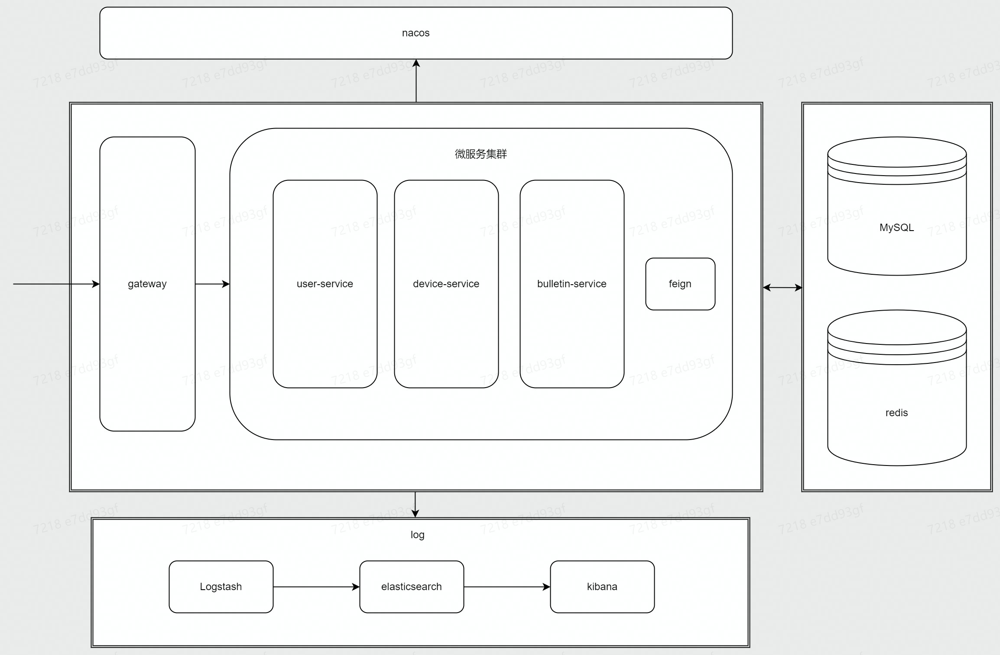

## 1.项目需求

## 2.项目框架

项目采用**前后端分离**。前端使用单页面模式，使用React。后端使用微服务架构，Java开发，使用Nacos。数据库采用MySQL。缓存采用Redis。日志收集为Logstash。日志管理为Elasticsearch。日志展示为Kibana。

前端项目命名为mbulletin-page、后端项目命名为mbulletin-server。

项目部署采用**伪分布式**，即部署到同一台主机上的不同端口。

---

### 前端框架


### 后端框架




## 3.核心问题

---

### 跨域

前后端分离，部署到不同的端口上，属于不同的域。 

对于前端使用ajax访问后端，浏览器发现属于不同域，会拦截访问的资源。解决方法是为后端返回的数据添加```Access-Control-Allow-Origin：http://localhost:3000```，这里做统一配置，在gateway模块中，配置允许前端域进行访问。 

对于其它情况，解决方法为拒绝外来访问直接访问后端接口。配置ufw，后端端口只允许本机访问。

---

### 微服务下session共享

gateway设置的微服务负载均衡策略为**轮询**，同一个会话下，会出现访问不同的微服务实例，导致session不一致而无法做到session资源共享。

通过**重写shiro管理session的实现类SessionDao，将session保存到redis当中实现共享**。

注意：axios请求需要配置```withCredentials: true```，确保每次会话cookie中SESSIONID相同。

---

### 权限管理

使用shiro框架，权限全由后端进行管理。权限管理可分为页面访问权限与端口调用权限。

#### 页面访问权限

只分**是否登录**能访问的页面。


#### 端口调用权限


## 4.生产环境配置

---

### DNS配置

#### 域名解析

项目部署到 mbulletin.meyok.top 域下，需要映射到服务器IP。

meyok.top 域在 NameSilo 服务商购买注册。

需要 Cloudflare 接管域名解析。把 NameSilo 预置的域名服务器换成 Cloudflare 提供的域名服务器，
添加 Name 为 @、www、mbulletin 的三条A类型的 DNS regard，映射到部署项目服务器的IP，让其做 CDN 。

#### HTTP加密

使用 Cloudflare 提供的 TLS 证书。在 Cloudflare 的源服务上生成证书，在 服务器 的 ```/etc/ssl/cert.pem``` 和 ```/etc/ssl/key.pem``` 分别保存生成的源证书与私钥。
修改 SSL/TLS 加密模式改为**严格**，以确保 Cloudflare 始终加密 Cloudflare 和 Nginx 服务器之间的连接。

在 Nginx 服务器上设置「Authenticated Origin Pulls」，以确保它只接受来自 Cloudflare 服务器的请求，防止任何其他人直接连接到 Nginx 服务器。
将 authenticated_origin_pull_ca.pem 的内容写入到服务器的 ```/etc/ssl/cloudflare.crt``` 中，内容如下：
```crt
-----BEGIN CERTIFICATE-----
MIIGCjCCA/KgAwIBAgIIV5G6lVbCLmEwDQYJKoZIhvcNAQENBQAwgZAxCzAJBgNV
BAYTAlVTMRkwFwYDVQQKExBDbG91ZEZsYXJlLCBJbmMuMRQwEgYDVQQLEwtPcmln
aW4gUHVsbDEWMBQGA1UEBxMNU2FuIEZyYW5jaXNjbzETMBEGA1UECBMKQ2FsaWZv
cm5pYTEjMCEGA1UEAxMab3JpZ2luLXB1bGwuY2xvdWRmbGFyZS5uZXQwHhcNMTkx
MDEwMTg0NTAwWhcNMjkxMTAxMTcwMDAwWjCBkDELMAkGA1UEBhMCVVMxGTAXBgNV
BAoTEENsb3VkRmxhcmUsIEluYy4xFDASBgNVBAsTC09yaWdpbiBQdWxsMRYwFAYD
VQQHEw1TYW4gRnJhbmNpc2NvMRMwEQYDVQQIEwpDYWxpZm9ybmlhMSMwIQYDVQQD
ExpvcmlnaW4tcHVsbC5jbG91ZGZsYXJlLm5ldDCCAiIwDQYJKoZIhvcNAQEBBQAD
ggIPADCCAgoCggIBAN2y2zojYfl0bKfhp0AJBFeV+jQqbCw3sHmvEPwLmqDLqynI
42tZXR5y914ZB9ZrwbL/K5O46exd/LujJnV2b3dzcx5rtiQzso0xzljqbnbQT20e
ihx/WrF4OkZKydZzsdaJsWAPuplDH5P7J82q3re88jQdgE5hqjqFZ3clCG7lxoBw
hLaazm3NJJlUfzdk97ouRvnFGAuXd5cQVx8jYOOeU60sWqmMe4QHdOvpqB91bJoY
QSKVFjUgHeTpN8tNpKJfb9LIn3pun3bC9NKNHtRKMNX3Kl/sAPq7q/AlndvA2Kw3
Dkum2mHQUGdzVHqcOgea9BGjLK2h7SuX93zTWL02u799dr6Xkrad/WShHchfjjRn
aL35niJUDr02YJtPgxWObsrfOU63B8juLUphW/4BOjjJyAG5l9j1//aUGEi/sEe5
lqVv0P78QrxoxR+MMXiJwQab5FB8TG/ac6mRHgF9CmkX90uaRh+OC07XjTdfSKGR
PpM9hB2ZhLol/nf8qmoLdoD5HvODZuKu2+muKeVHXgw2/A6wM7OwrinxZiyBk5Hh
CvaADH7PZpU6z/zv5NU5HSvXiKtCzFuDu4/Zfi34RfHXeCUfHAb4KfNRXJwMsxUa
+4ZpSAX2G6RnGU5meuXpU5/V+DQJp/e69XyyY6RXDoMywaEFlIlXBqjRRA2pAgMB
AAGjZjBkMA4GA1UdDwEB/wQEAwIBBjASBgNVHRMBAf8ECDAGAQH/AgECMB0GA1Ud
DgQWBBRDWUsraYuA4REzalfNVzjann3F6zAfBgNVHSMEGDAWgBRDWUsraYuA4REz
alfNVzjann3F6zANBgkqhkiG9w0BAQ0FAAOCAgEAkQ+T9nqcSlAuW/90DeYmQOW1
QhqOor5psBEGvxbNGV2hdLJY8h6QUq48BCevcMChg/L1CkznBNI40i3/6heDn3IS
zVEwXKf34pPFCACWVMZxbQjkNRTiH8iRur9EsaNQ5oXCPJkhwg2+IFyoPAAYURoX
VcI9SCDUa45clmYHJ/XYwV1icGVI8/9b2JUqklnOTa5tugwIUi5sTfipNcJXHhgz
6BKYDl0/UP0lLKbsUETXeTGDiDpxZYIgbcFrRDDkHC6BSvdWVEiH5b9mH2BON60z
0O0j8EEKTwi9jnafVtZQXP/D8yoVowdFDjXcKkOPF/1gIh9qrFR6GdoPVgB3SkLc
5ulBqZaCHm563jsvWb/kXJnlFxW+1bsO9BDD6DweBcGdNurgmH625wBXksSdD7y/
fakk8DagjbjKShYlPEFOAqEcliwjF45eabL0t27MJV61O/jHzHL3dknXeE4BDa2j
bA+JbyJeUMtU7KMsxvx82RmhqBEJJDBCJ3scVptvhDMRrtqDBW5JShxoAOcpFQGm
iYWicn46nPDjgTU0bX1ZPpTpryXbvciVL5RkVBuyX2ntcOLDPlZWgxZCBp96x07F
AnOzKgZk4RzZPNAxCXERVxajn/FLcOhglVAKo5H0ac+AitlQ0ip55D2/mf8o72tM
fVQ6VpyjEXdiIXWUq/o=
-----END CERTIFICATE-----
```

---

### 服务器配置

目前来说服务器为一台 VPS ，不同服务部署到不同端口。也可以部署到 ECS 上，但**国内部署网站需要备案**，
而国内 ECS 提供商目前提供备案服务需要购买至少三个月的 ECS ，考虑到经济问题，目前还是部署到 VPS 上，今后会转移到国内 ECS 上。

这里 VPS 提供商为 Hostens ，今后可能会改为 Hostwinds 。

VPS 操作系统为 Ubuntu20.04 。

#### 服务器预处理

禁止通过 SSH 登录到 root 用户，并限制 SSH 通过用户密码来登录，仅能通过密钥登录服务器。编辑 ```/etc/ssh/sshd_config```。
```sh
PermitRootLogin no
PasswordAuthentication no
```
需要重启 sshd 服务
```shell
sudo systemctl restart sshd
```

禁止运维使用 root 用户进行操作，这里新建用户 meyok 进行运维。
```shell
useradd -m -s /bin/bash -G sudo meyok
passwd meyok
...
su - meyok
```

#### 防火墙UFW

只允许访问SSH（22端口）、NGINX（80、443端口）。
```shell
sudo ufw enable
sudo ufw default deny 
sudo ufw allow 'OpenSSH'
sudo ufw allow 'Nginx Full'
```

#### 反向代理NGINX

为了防止可能出现的内存问题，有必要调整 ```/etc/nginx/nginx.conf``` 文件中的一个值：
```sh
...
http {
    ...
    server_names_hash_bucket_size 64;
    ...
}
...
```

[//]: # (TODO 完善/修改NGINX配置文件，包括nacos集群等)
编辑文件 ```/etc/nginx/sites-available/meyok.top```：
```
server {
  listen 80 default_server;
  listen [::]:80 default_server;

  server_name meyok.top www.meyok.top mbulletin.meyok.top;

  return 301 https://$host$request_uri;
}

server {
  listen 443 ssl http2;
  listen [::]:443 ssl http2;

  ssl_certificate /etc/ssl/cert.pem;
  ssl_certificate_key /etc/ssl/key.pem;
  ssl_client_certificate /etc/ssl/cloudflare.crt;
  ssl_verify_client on;
  ssl_session_timeout 1d;
  ssl_session_cache shared:MozSSL:10m;
  ssl_session_tickets off;

  # intermediate configuration
  ssl_protocols TLSv1.2 TLSv1.3;
  ssl_ciphers ECDHE-ECDSA-AES128-GCM-SHA256:ECDHE-RSA-AES128-GCM-SHA256:ECDHE-ECDSA-AES256-GCM-SHA384:ECDHE-RSA-AES256-GCM-SHA384:ECDHE-ECDSA-CHACHA20-POLY1305:ECDHE-RSA-CHACHA20-POLY1305:DHE-RSA-AES128-GCM-SHA256:DHE-RSA-AES256-GCM-SHA384;
  ssl_prefer_server_ciphers off;

  # HSTS (ngx_http_headers_module is required) (63072000 seconds)
  add_header Strict-Transport-Security "max-age=63072000" always;

  server_name mbulletin.meyok.top;

  location / {
    proxy_redirect off;
    proxy_pass http://127.0.0.1:3000;
    proxy_http_version 1.1;
    proxy_set_header Upgrade $http_upgrade;
    proxy_set_header Connection "upgrade";
    proxy_set_header Host $host;

    proxy_set_header X-Real-IP $remote_addr;
    proxy_set_header X-Forwarded-For $proxy_add_x_forwarded_for;
  }

}
```


#### 服务

各服务均采用 Docker 容器部署。在使用 Docker 前，需要把当前运维人员用户加入并转换到 docker 用户组：
```shell
sudo usermod -aG docker meyok
newgrp docker
```

[//]: # (TODO 完成 docker-compose.yml 文件编排)
```docker-compose.yml``` 编排如下：
```yaml

```

##### 数据库MySQL

版本为8.0.30。

登录用户为root，密码为 ****** 。单体部署，部署端口为3306。

项目存于 mbulletin 数据库下。

[//]: # (TODO 更新导出的 sql 文件)
数据库 sql 文件为：
```sql
-- MySQL dump 10.13  Distrib 8.0.30, for Win64 (x86_64)
--
-- Host: 127.0.0.1    Database: mbulletin
-- ------------------------------------------------------
-- Server version	8.0.30

/*!40101 SET @OLD_CHARACTER_SET_CLIENT=@@CHARACTER_SET_CLIENT */;
/*!40101 SET @OLD_CHARACTER_SET_RESULTS=@@CHARACTER_SET_RESULTS */;
/*!40101 SET @OLD_COLLATION_CONNECTION=@@COLLATION_CONNECTION */;
/*!50503 SET NAMES utf8mb4 */;
/*!40103 SET @OLD_TIME_ZONE=@@TIME_ZONE */;
/*!40103 SET TIME_ZONE='+00:00' */;
/*!40014 SET @OLD_UNIQUE_CHECKS=@@UNIQUE_CHECKS, UNIQUE_CHECKS=0 */;
/*!40014 SET @OLD_FOREIGN_KEY_CHECKS=@@FOREIGN_KEY_CHECKS, FOREIGN_KEY_CHECKS=0 */;
/*!40101 SET @OLD_SQL_MODE=@@SQL_MODE, SQL_MODE='NO_AUTO_VALUE_ON_ZERO' */;
/*!40111 SET @OLD_SQL_NOTES=@@SQL_NOTES, SQL_NOTES=0 */;

--
-- Table structure for table `user_certify`
--

DROP TABLE IF EXISTS `user_certify`;
/*!40101 SET @saved_cs_client     = @@character_set_client */;
/*!50503 SET character_set_client = utf8mb4 */;
CREATE TABLE `user_certify` (
  `id` bigint unsigned NOT NULL AUTO_INCREMENT,
  `snowflake_id` bigint unsigned NOT NULL,
  `is_certified` tinyint unsigned NOT NULL DEFAULT '0',
  `check_code` char(32) NOT NULL,
  `gmt_create` datetime NOT NULL,
  `gmt_modified` datetime NOT NULL,
  PRIMARY KEY (`id`),
  UNIQUE KEY `user_certify_info_snowflake_id_uindex` (`snowflake_id`),
  UNIQUE KEY `user_certify_info_id_uindex` (`id`),
  CONSTRAINT `fk_snowflake_id` FOREIGN KEY (`snowflake_id`) REFERENCES `user_privacy` (`snowflake_id`)
) ENGINE=InnoDB AUTO_INCREMENT=12 DEFAULT CHARSET=utf8mb4 COLLATE=utf8mb4_0900_ai_ci;
/*!40101 SET character_set_client = @saved_cs_client */;

--
-- Dumping data for table `user_certify`
--

LOCK TABLES `user_certify` WRITE;
/*!40000 ALTER TABLE `user_certify` DISABLE KEYS */;
INSERT INTO `user_certify` VALUES (11,1586591654100336641,1,'os9HgYuRNj9NvFs6X6oRAuQhNfYmsHRj','2022-10-30 05:31:42','2022-10-30 05:31:42');
/*!40000 ALTER TABLE `user_certify` ENABLE KEYS */;
UNLOCK TABLES;

--
-- Table structure for table `user_privacy`
--

DROP TABLE IF EXISTS `user_privacy`;
/*!40101 SET @saved_cs_client     = @@character_set_client */;
/*!50503 SET character_set_client = utf8mb4 */;
CREATE TABLE `user_privacy` (
  `id` bigint unsigned NOT NULL AUTO_INCREMENT,
  `snowflake_id` bigint unsigned NOT NULL,
  `email` varchar(50) NOT NULL,
  `username` varchar(255) NOT NULL,
  `pwd` char(32) NOT NULL,
  `salt` char(32) NOT NULL,
  `gmt_create` datetime NOT NULL,
  `gmt_modified` datetime NOT NULL,
  PRIMARY KEY (`id`),
  UNIQUE KEY `user_info_email_uindex` (`email`),
  UNIQUE KEY `user_info_id_uindex` (`id`),
  UNIQUE KEY `user_register_info_snowflake_id_uindex` (`snowflake_id`)
) ENGINE=InnoDB AUTO_INCREMENT=24 DEFAULT CHARSET=utf8mb4 COLLATE=utf8mb4_0900_ai_ci;
/*!40101 SET character_set_client = @saved_cs_client */;

--
-- Dumping data for table `user_privacy`
--

LOCK TABLES `user_privacy` WRITE;
/*!40000 ALTER TABLE `user_privacy` DISABLE KEYS */;
INSERT INTO `user_privacy` VALUES (23,1586591654100336641,'MeYokYang@163.com','xiaochen','93a3f58f643b438d8ffdfbb5539222b0','0Hyj4cD5Cr4cq0WPQF%aDpe!UTEd#zAo','2022-10-30 05:31:42','2022-10-30 05:31:42');
/*!40000 ALTER TABLE `user_privacy` ENABLE KEYS */;
UNLOCK TABLES;
/*!40103 SET TIME_ZONE=@OLD_TIME_ZONE */;

/*!40101 SET SQL_MODE=@OLD_SQL_MODE */;
/*!40014 SET FOREIGN_KEY_CHECKS=@OLD_FOREIGN_KEY_CHECKS */;
/*!40014 SET UNIQUE_CHECKS=@OLD_UNIQUE_CHECKS */;
/*!40101 SET CHARACTER_SET_CLIENT=@OLD_CHARACTER_SET_CLIENT */;
/*!40101 SET CHARACTER_SET_RESULTS=@OLD_CHARACTER_SET_RESULTS */;
/*!40101 SET COLLATION_CONNECTION=@OLD_COLLATION_CONNECTION */;
/*!40111 SET SQL_NOTES=@OLD_SQL_NOTES */;

-- Dump completed on 2022-10-30 15:28:24

```

##### 缓存Redis

版本为5.0.14.1。

单体部署，部署端口为6379。


##### 微服务Nacos

版本为2.0.0-ALPHA.2。

登录用户为 nacos ，密码为 ******。集群部署，部署端口为 16101、16102、16103 。

需要 pro 命名空间，将后端服务实例即配置放在改命名空间里，命名空间编号为 45a0c9a0-40ad-451b-b462-e4732a52226e 。

pro 命名空间下，各微服务配置：
* ```gateway-pro.yml```：
  ```yaml

  ```
* ```userservice-pro.yml```：
  ```yaml
  spring:
    mail: # 邮件配置
      host: smtp.qq.com
      username: 2553774545@qq.com
      password: \******
    datasource: # mysql配置
      driver-class-name: com.mysql.jdbc.Driver # 数据库驱动
      url: jdbc:mysql:///mbulletin?serverTimezone=UTC&useSSL=false  # 数据库连接对象url
      username: root  # 用户名
      password: \******  # 密码
    redis: # redis配置
      host: localhost
      port: 6379
  ```
* ```deviceservice-pro.yml```：
  ```yaml

  ```
* ```bulletinservice-pro.yml```：
  ```yaml

  ```

##### 后端服务mbulletin-server

Java 版本为8，spring cloud 版本为 Hoxton.SR10 ，spring boot 版本为 2.3.9.RELEASE 。

各微服务部署配置如下：

1. gateway

   单体部署，部署端口为 10010 。

3. user-service

   集群部署，部署端口为 16011、16012、16013 。

4. device-service

   集群部署，部署端口为 16021、16022、16023 。

5. bulletin-service

   集群部署，部署端口为 16031、16032、16033 。


##### 前端服务mbulletin-page

node.js 版本为 16.17.0 。 单体部署，部署端口为 3000 。


##### 日志管理ELK

版本均为 7.3.2 。

Logstash 做日志收集，Elasticsearch 做日志管理，Kibana 做可视化界面。

各相关配置如下：

1. Logstash
    
    单体部署，部署端口为 9600 。

    编辑配置文件 ```${Logstash_HOME}/config/pro.conf``` ：
    ```conf
    input {
        file {
            path => ["~/logs/log-*.log"]
            start_position => "beginning"
        }
    }

    filter {
        grok {
            match => {"message" => "%{DATA:datetime}\ \[%{DATA:thread}\]\ %{DATA:level}\ \ %{DATA:class}\ -\ %{GREEDYDATA:logger}"}
            remove_field => ["message"]
        }
        date {
            match => ["timestamp", "yyyy-MM-dd HH:mm:ss.SSS"]
        }
        if "_grokparsefailure" in [tags] {
            drop { }
        }
    }
   
    output {
        elasticsearch {
            hosts => ["127.0.0.1:9200"]
            index => "logger-%{+YYYY.MM.dd}"
        }
    }
   ```

2. Elasticsearch

    单体部署，部署端口为 9200 。
    
    需要添加IK分词器，版本为 7.3.2 ， 将下载好的压缩包解压到 ```${Elasticsearch_HOME}/plugins/ik```下。
    
    在 ```${Elasticsearch_HOME}/config/elasticsearch.yml``` 中配置相关信息：
    ```yaml
    node.name: node-1
    cluster.initial_master_nodes: ["node-1"]
    xpack.ml.enabled: false
    http.cors.enabled: true
    http.cors.allow-origin: /.*/
    ```

4. Kibana

    单体部署，部署端口为 5601 。

## 5.相关BUG

---

### 用户注册未注册邮箱

用户注册未注册邮箱时，相关信息也会被保存。但发送邮箱校验邮件后，邮件会被退回。

---

### 已登录用户session下可访问未登录用户的主页

同一浏览器session下，登录某个用户后访问其主页，如“/home/xiaochen”。这时shiro确实校验了用户认证可以访问。但当在同一个浏览器下开启一个新窗口（即同一个session下）访问其他人主页，如“/home/xiaowang”，是可以访问的，但权限依然是登录用户的权限。

即展示用户的不敏感信息（这里只有username），与用户的权限不属于同一个用户。